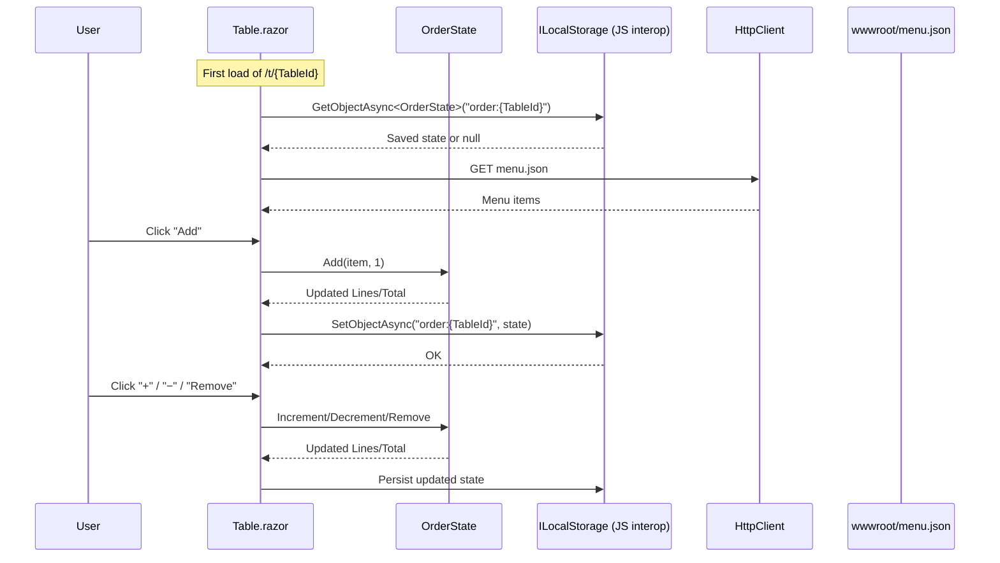

# Restaurant order manager

A minimal Blazor WebAssembly app for managing restaurant table orders from a browser. It loads a menu from `orders/wwwroot/menu.json`, lets guests add items to an order per table, keeps a running total, and persists the cart to `localStorage` per table.

## Features
- Table page at route `/t/{TableId}` showing the menu grouped by category
- CRUD operations on an order.
- Submitting an order
- Live total calculation based on order lines and unit prices

## Getting started

Prerequisites:
- .NET SDK 10.0 (C# 14)
- A modern browser

Run from the command line:
```
dotnet restore
dotnet run --project orders --launch-profile https
```
The app will start using the URLs from `orders/Properties/launchSettings.json`. By default:
- HTTPS: https://0.0.0.0:7288
- HTTP:  http://0.0.0.0:5271

Open a table page, for example: `https://0.0.0.0:7288/t/A1`.

### Editing the menu
- Menu file: `orders/wwwroot/menu.json`
- Model types: `orders/Models/MenuItem.cs`, `orders/Models/OrderLine.cs`

## Key routes and components
- `orders/App.razor`: Router setup and not-found handling
- `orders/Pages/Table.razor`: Main table ordering UI (`/t/{TableId}`)
- Services
  - `IMenuService` + `MenuServiceWwwroot`: loads `menu.json`
  - `ILocalStorage` + `LocalStorageJs`: persists state via JS interop

## Data flow (Mermaid)
```mermaid
flowchart LR
    U[User Browser]
    B[Blazor WASM Components\nTable.razor]
    S[OrderState\n(Total, Lines)]
    LS[(Browser localStorage)]
    M[menu.json\n(orders/wwwroot)]
    HC[HttpClient]

    U -->|Clicks Add/+/−/Remove| B -->|mutates| S
    B -->|persist json| LS
    B -->|load cached state| LS
    B -->|GetMenuAsync()| HC -->|GET /menu.json| M
```

## Typical interaction sequence (Mermaid)


## Project layout
- `orders/` Blazor WASM project
  - `Pages/` pages (`Home.razor`, `Table.razor`, `NotFound.razor`)
  - `Services/` app services (`IMenuService`, `MenuServiceWwwroot`, `ILocalStorage`, `LocalStorageJs`)
  - `Models/` domain models (`OrderState`, `OrderLine`, `MenuItem`)
  - `wwwroot/` static content (`index.html`, `menu.json`, CSS)

## Notes
- Submitting an order currently just persists the cart; integrate a backend later by POSTing `OrderState` from `Table.razor`.
- Clear a table’s cart by clearing browser storage key `order:{TableId}` or using the UI to remove lines.

## License
See `LICENSE` in the repository root.